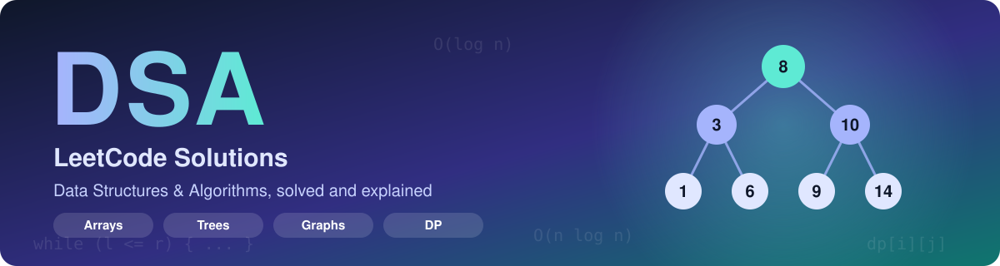
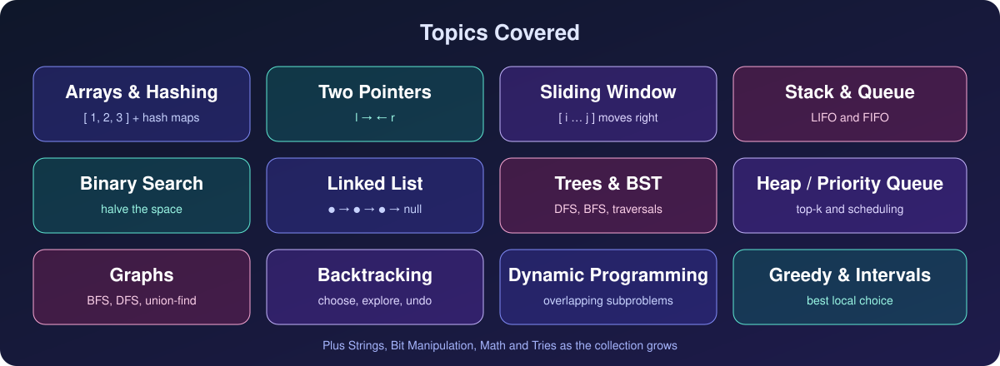
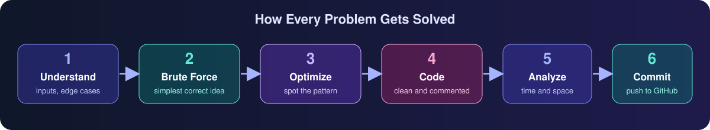
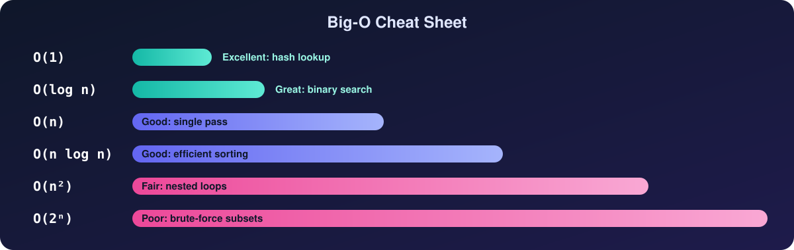
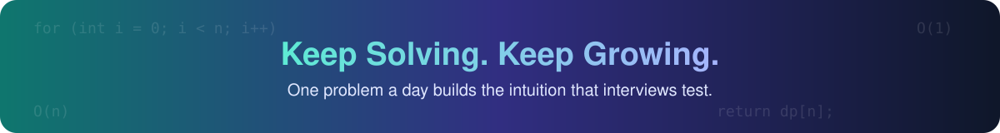

<div align="center">



<br/>


<br/>

[](https://leetcode.com/)

</div>

---

## 📌 Overview

**DSA** is my personal collection of **LeetCode solutions**. Every problem I solve lands here with
clean, commented code, the idea behind the approach, and its **time and space complexity**. The
goal is simple: build strong problem-solving instincts, one problem at a time, and keep a record
I can revisit before interviews.

> 💡 Each solution is written to be read, not just run. If you are learning DSA, follow the
> approach notes first and try the problem yourself before looking at the code.

---

## 🎯 What You'll Find Here

<table>
<tr><td width="33%" valign="top">

### 🧠 Clear Approaches
- Brute force first, then the optimized idea
- Why the pattern works
- Edge cases worth remembering

</td><td width="33%" valign="top">

### ⏱️ Complexity Analysis
- Time complexity for every solution
- Space complexity for every solution
- Trade-offs between approaches

</td><td width="34%" valign="top">

### 🗂️ Organized by Topic
- Arrays, Strings, Linked Lists
- Trees, Graphs, Heaps
- DP, Greedy, Backtracking

</td></tr>
</table>

---

## 🧩 Topics Covered



Problems are grouped by the data structure or technique they train, so it is easy to practice one
topic at a time.

---

## 🔄 My Problem-Solving Approach



I never jump straight to code. I make sure I understand the problem, find a correct baseline,
then look for the pattern that makes it faster. Only then do I write the final solution and
analyze its cost.

---

## ⏱️ Big-O Cheat Sheet



A quick reminder of how common complexities compare. Every solution here states its time and
space complexity so you can see which trade-offs were made.

---

## 📊 Progress Tracker


<!-- PROGRESS:START -->
| Difficulty | Solved |
|---|---|
| 🟢 Easy | 1 |
| 🟡 Medium | 4 |
| 🔴 Hard | 1 |
| **Total** | **6** |
<!-- PROGRESS:END -->

> 🤖 These numbers update automatically every time I push a new solution.

---

## 🧾 Solution Format

Every solution file is named `number-problem-name.ext` (for example `0856-score-of-parentheses.py`)
and starts with the same header, so it is quick to scan:

```python
"""
856. Score of Parentheses
Difficulty: Medium
Topic: Stack
Link: https://leetcode.com/problems/score-of-parentheses/

Approach:
    The core idea in a few lines.

Complexity:
    Time:  O(n)
    Space: O(n)
"""

class Solution:
    ...
```

---

## 🤖 Self-Updating README

A GitHub Action runs on every push. It reads the header of each solution file, then rewrites the
**Progress Tracker** and the **Problem Log** automatically, including links to the code and to any
problem images. Add a solution, push, and the README updates itself.

---

## 🗒️ Problem Log

<!-- LOG:START -->
| # | Problem | Topic | Difficulty | Solution |
|---|---|---|---|---|
| 1 | [Two Sum](https://leetcode.com/problems/two-sum/) | Junior, Array, Hash Table | 🟢 Easy | [Python](./Solutions/1_Two_Sum.py) |
| 2 | [Add Two Numbers](https://leetcode.com/problems/add-two-numbers/) | Linked List, Math | 🟡 Medium | [Python](./Solutions/2_Add_Two_Numbers.py) |
| 4 | [Median of Two Sorted Arrays](https://leetcode.com/problems/median-of-two-sorted-arrays/) | Array, Sorting | 🔴 Hard | [Python](./Solutions/4_Median_of_Two_Sorted_Arrays.py) |
| 678 | [Valid Parenthesis String](https://leetcode.com/problems/valid-parenthesis-string/) | Stack, Dynamic Programming, Top-Down Approach | 🟡 Medium | [Python](./Solutions/678_Valid_Parenthesis_String.py) |
| 856 | [Score of Parentheses](https://leetcode.com/problems/score-of-parentheses/) | String | 🟡 Medium | [Python](./Solutions/856_Score_of_Parentheses.py) |
| 921 | [Minimum Add to Make Parentheses Valid](https://leetcode.com/problems/minimum-add-to-make-parentheses-valid/) | Stack | 🟡 Medium | [Python](./Solutions/921_Minimum_Add_to_Make_Parentheses_Valid.py) |
<!-- LOG:END -->

---

## 🚀 Getting Started

```bash
git clone https://github.com/gundatejeswararao7/DSA.git
cd DSA
```

Open any topic, pick a problem, and read the approach before the code. To run a solution, use the
compiler or interpreter for the language it is written in.

---

## 🌱 Contributing

Found a bug or a cleaner approach? Suggestions are welcome.

```bash
git checkout -b improve/problem-name
# make your changes and test them
git add .
git commit -m "Improve solution for problem-name"
git push origin improve/problem-name
```

Then open a pull request.

---

## 📄 License

This repository is for learning and practice. Add an open-source license if you want others to
reuse the code.

---

<div align="center">

## 📫 Author

**Gundatejeswararao7**

[](https://github.com/gundatejeswararao7)
[](https://leetcode.com/)

## ⭐ Support

If this repo helps your prep, consider giving it a star.

<br/>



</div>
